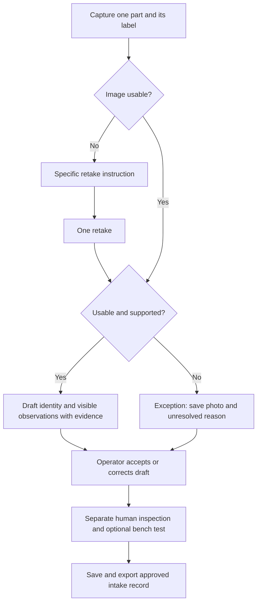

# DeepSpec: one-week parts intake pilot

Executive Summary: Spend September 21–27 proving that DeepSpec reduces the active work of documenting incoming parts. Start with one independent starter/alternator rebuilder or used-parts seller, one part family, and one receiving bench. Automate the draft and request better evidence; keep identity confirmation and functional checks human. Test $99/month first and $249/month only where measured volume supports it. These are product and pricing hypotheses, not validated demand or current checkout offers.

Prepared September 20, 2026. This document is a plan, not a claim that its features, pilot, deployment, or acceptance gates have passed. One builder plus one pilot operator is the assumed capacity. If no operator is recruited, run an internal rehearsal and report the customer experiment as blocked.

Current engineering checkpoint: all eight core flows have been exercised in a mobile-emulated browser, including one real engine-image analysis. A later full regression passed 910 tests across 72 files; subsequent changes have their own focused checks. The latest browser run passed login, session restoration without old-record replay, guided retake, failed-save recovery and History. See [the continuing build log](BUILD_LOG_2026-09-20.md) for exact versions, reports and limits. These checks do not establish physical-phone behavior, general identification accuracy, measured labor savings or demand.

Two generated accounts passed owner access and cross-account read isolation for exercised scan/detail tables and private images. Account-scoped device storage and stale-work guards passed shared-device QA. Cloud fixtures now have checked cleanup; temporary anonymous auth accounts remain. Inspection cloud persistence is still blocked by the missing `inspection_json` column. Shop-member sharing, unseen concurrent edits and recovery of unassigned legacy device records remain separate unresolved cases.

## Next work in order

| Priority | Work and owner | Exit evidence |
| --- | --- | --- |
| 1 | Database operator deploys the existing inspection migration through the normal process; builder reruns `npm run verify:supabase -- --inspection`. | Owner save/read/update, preserved AI/human evidence, second-account read/write denial and checked fixture cleanup. Current preflight is blocked; no scan/image fixtures were written by that blocked run. |
| 2 | Builder and operator exercise a physical phone: permission grant/denial, camera selection, dim/glare cases, interruption, save/reload/export. | Actual device/browser versions, observed results and retained evidence. Browser emulation is not a substitute for this gate. |
| 3 | Founder recruits one willing receiving bench and obtains permission for the narrow pilot. Observe ten ordinary manual items. | Real workflow, one chosen family, active-time baseline, known identity references where available, and data-use permission. No outreach or customer commitment has been made by this task. |
| 4 | Run the two distinct 20-part batches below; fix the largest measured source of extra work between batches. | Complete denominators, time/error measurements and a buyer decision at a stated price. Internal QA results cannot substitute for customer evidence. |
| 5 | Consider more unattended behavior only if it addresses the measured bottleneck. | Server revision/conflict handling before automatic old-record uploads; permission and held-out evaluation before training; a measured benefit before adding 3D to the runtime. |

## Starting point: implemented versus planned

| Status | Capability and evidence | Limits |
| --- | --- | --- |
| Implemented in repository | Camera/upload scanner, image quality feedback, focused image handling, AI result and retake/retry paths: `src/screens/Scanner.tsx`, `api/identify.shared.ts`. | Live provider reliability and category accuracy require measurement; model confidence is not calibrated proof. |
| Implemented in repository | Saved history, result detail, chat, text reports, and optional human inspection: `src/components/result/PartInspectionForm.tsx`, `src/services/storage.ts`, `src/services/report.ts`. | Human entry still takes effort. No guarantee of correct identity, fitment, condition, or function. |
| Implemented; rollout prerequisite | Separate inspection cloud field and compatible reads: `src/services/cloudSync.ts`, `src/services/cloudHistory.ts`, migration `20260920000100_part_inspection.sql`. | Migration deployment and live account/RLS verification must be confirmed. The implementation task did not deploy the migration. Concurrent writes remain last-write-wins. |
| Implemented in repository | Automatic intake draft on saved result detail and text exports, with identity source, unverified part number, functional status and outstanding checks. See [verification](INTAKE_DRAFT_2026-09-20.md). | Derived from the saved scan; no automatic approval, fitment certification or functional diagnosis. |
| Implemented in repository | Explicit unresolved identity with reasons on scanner, saved details and reports; unresolved filter in history. See [build log](BUILD_LOG_2026-09-20.md). | Model uncertainty is not independently validated ground truth. |
| Implemented in repository | Rejected quality-check photos are saved; one guided retake per active scanner sequence for poor images or AI photo requests. Reload and downloaded quality-exception reports tested. | Retake cap resets for a separate scan/reload; no structured cross-device lineage. Not unattended intake; keep manual approval during the pilot. |
| Implemented and exercised | Account-scoped device evidence, stale-work guards, a preserving 50-record limit, export and explicit device-record removal. | Browser namespaces are not encryption. Removal frees the stored record, not all cached/open-page copies or cloud data. Unassigned legacy records are preserved separately. |
| Implemented and exercised | Durable save receipts, live History status and explicit per-record cloud retry. Login preserves older records without bulk replay. | Acknowledgements describe completed requests, not exact server equality. Inspection-only saves are labeled separately. No automatic reconnect queue or multi-device conflict resolution. |
| Deferred | Stock movement, purchasing, marketplace publishing, catalog licensing, multi-location automation, verified bench-test integrations, model training. | Do not promise these in the pilot offer. |

See [the inspection pilot notes](PART_INSPECTION_PILOT.md) for the current separation between AI answers, human inspection, and training permission. "Implemented" means code exists; production readiness depends on the separate QA report and rollout checks.

## First buyer and the job to solve

Rollout check on September 20: a read-only query confirmed that the connected
database lacks `inspection_json`. Apply the existing inspection migration and
verify real save/reload before promising cloud inspection records to a pilot.

Recruit an owner or operations lead whose staff repeatedly photograph and type intake descriptions for loose starters or alternators. Qualifying assumptions to test: roughly 10–30 relevant items per working day, readable markings on some items, access to permitted reference information, and an existing spreadsheet or stock system into which staff can copy an approved record. Choose either starters or alternators with that operator on day one. Do not expand categories during the week.

The offer: "Turn a part photo into a draft intake record, show what evidence is missing, and preserve the inspection you actually performed." The operator keeps the existing stock system. DeepSpec must save enough effort before an integration becomes justified. A general repair shop already satisfied by VIN-based ordering may be a poor first buyer.

The first buyer and throughput figures above are selection hypotheses. No customer interview, purchase commitment, or market-size estimate is implied. Recruitment and pricing conversations are proposed human actions; this plan does not authorize automated outreach.

## Workflow to build and measure

Automate photo attachment, draft wording, visible evidence summary, missing-evidence prompts, and persistence. Reuse current result/report infrastructure; add only the fields and state needed for the pilot. Prefer a simple exception status over building a queue service. A human may still handle many exceptions this week; measure the burden rather than hiding it.

Never populate the human-confirmed identity or passed-test fields from AI. Label unreadable or unsupported exact part numbers as unresolved. Keep visible appearance separate from function; default function to **Not tested**. A readable marking can support a draft, but catalog/fitment claims require the operator's reference check. Confidence alone must not authorize automatic acceptance. Route provider errors, poor photos, conflicting markings, and unsupported parts to an explicit exception with the original evidence retained. Cap guided retakes at one for the pilot; further work is an operator decision, not an infinite retry loop.

## Daily acceptance gates

Use [the pilot measurement packet](PILOT_RUNBOOK.md) and its empty observation template. A tested local summary command is included; it reports no observations until actual measured records are supplied.

| Day | Work and concrete deliverable | Gate before proceeding |
| --- | --- | --- |
| Mon Sep 21 | Confirm one operator/category. Observe 10 ordinary intake items; record photo, typing, lookup, correction and functional-test time separately. Record current tooling and data permission. | Written scope and baseline log; known reference for identity where available; no invented ground truth. Confirm QA and migration status. If auth/cloud blocked, label rehearsal local-only and do not claim sync. |
| Tue Sep 22 | Assemble the smallest draft/retake/exception path using existing scanner and report. Display unresolved identity explicitly. | Scripted good-photo, blur, unreadable-label, provider-error and unsupported-part cases each end in a saved draft or explicit exception. No case silently becomes a confirmed identity or functional pass. |
| Wed Sep 23 | Verify record lifecycle and define measurement sheet. Prepare distinct physical parts for evaluation, separate from development examples. | Save/reload/export and cross-device checks retain original AI, human notes, inspector/time and unresolved fields. Failed sync remains visibly unsynced. Permission isolation checked with dedicated test accounts; no other shop's records visible. |
| Thu Sep 24 | Run first 20 held-out physical parts with the operator. Alternate comparable manual and assisted groups; balance easy/hard items and operator order. Count every retake, failure, correction and abandoned attempt. | Report denominators, active time and elapsed time separately. All externally used records reviewed by a person. Any unsupported claim promoted to confirmed stops expansion and becomes a regression case. |
| Fri Sep 25 | Fix the single largest measured source of operator work. Run a second 20-part batch, keeping its results separate. Ask the buyer to choose paid continuation at the quoted scope/price or decline. | Target at least 30% median active-time reduction without more wrong accepted identities than baseline; report exact counts and time distributions. This is a pilot gate, not an accuracy claim. If missed, diagnose/repeat rather than declare launch. |
| Sat Sep 26 | Repeat bad-network/reload/export cases and perform the optional 3D experiment below. Document support effort and per-record service cost. | No lost records in the exercised cases; test report distinguishes app defects, test defects, missing credentials and infrastructure. No paid rollout while unresolved record-loss/auth issues remain. |
| Sun Sep 27 | Write one-page decision: continue, narrow category, or stop. Include actual time saved, errors, unresolved rate, retakes, costs and buyer response. | Continue only with reproducible workflow benefit, acceptable observed quality, and an explicit buyer commitment. Otherwise retain the useful code and schedule the next bounded experiment; do not add categories/features to mask failure. |

If recruitment or rollout slips, move the dependent days. Do not compress a promised live pilot into synthetic results. Forty evaluated parts are a learning sample, not evidence of broad accuracy or safety. Report family coverage and hard failures, including unknown true identity. Avoid retesting the same physical item as independent evidence after learning its label.

## Pricing experiments and ROI arithmetic

Quote monthly, cancellable pilot continuation; no automatic payment or checkout change is part of this plan. Proposed scopes below require the day-five gate and cost measurement first.

| Experiment | Proposed scope | Hypothetical buyer value at $30/hour loaded labor cost |
| --- | --- | --- |
| $99/month | One intake bench, one category, up to 300 intake records/month, export and ordinary asynchronous support. | 300 records × 2 net minutes saved ÷ 60 × $30 = $300/month labor capacity; $201 above subscription before buyer setup costs. |
| $249/month | One site, same validated category, up to 1,000 records/month; higher volume rather than unbuilt enterprise features. | 1,000 × 2 ÷ 60 × $30 = $1,000/month; $751 above subscription before setup costs. |

These prices and quotas are experiments, not current entitlements. Do not implement the larger offer if provider capacity or support burden cannot sustain it. Count a record once, include bounded retries in provider costs, and define overage policy before selling; do not surprise customers with per-retry fees.

At $30/hour, each net minute is $0.50. Break-even is 198 minutes/month for $99, and 498 minutes/month for $249. At 2 minutes saved, that is 99 or 249 records/month. At only 0.5 minute saved and 300 records/month, value is $75: even $99 fails this assumption. With $20/hour labor and 2 minutes saved, break-even rounds up to 149 and 374 records respectively.

Use **net active minutes saved after corrections, retakes and exception handling**. Keep required bench-test time in both workflows; do not claim savings by removing it. Time freed is capacity, not guaranteed payroll reduction or revenue. Deduct amortized onboarding effort. Do not monetize avoided returns or increased sales until observed with a credible comparison.

For DeepSpec, log actual AI/storage cost per completed record including failures, and founder/operator support time. Example cost ceilings to investigate, not achieved margins: a $99/300-record offer has $0.33 revenue per included record; a $249/1,000 offer has $0.249. A nominal 70% contribution target leaves $29.70 or $74.70 for all variable costs, including support and payment fees. One hour of support at an assumed $30/hour already consumes the smaller allowance. Narrow scope or raise price if measured support makes the offer uneconomic.

## Primary competitor evidence and implication

Public pages checked September 20, 2026. These are adjacent substitutes and budget references, not proof of direct feature equivalence or demand. Commercial services; no code/content license for reuse was assessed because none is being copied.

| Name and primary source | Public price evidence | Relevant capability | Implication for DeepSpec |
| --- | --- | --- | --- |
| [PartsTech](https://partstech.com/pricing/) | Free $0; page displays Plus $45/mo and Complete $85/mo alongside monthly/annual selectors. Reconfirm selected cadence when comparing an actual quote. | Parts lookup/ordering, supplier prices, VIN lookup and shop-system integrations. | Do not sell generic catalog lookup at $99. Test labor saved on documenting the actual loose item. |
| [Sortly](https://www.sortly.com/pricing/) | Advanced shows $49 versus promotional $24/month billed $288/year; Ultra $149 versus $74 billed $888/year. First-year annual promotion has different renewal terms. | Photo inventory, barcode/QR workflows; Advanced lists 500 items/2 users and Ultra 2,000/5. | Existing inventory software sets a low replacement threshold. Complement it before rebuilding stock management. |
| [Fullbay](https://www.fullbay.com/pricing/) | Basic $188/month including one full user; extra users $89/month. Pro $258/month. Annual agreement, monthly billing. | Heavy-duty shop operations and parts inventory; Pro includes technician-note AI features. | $249 is a substantial narrow-tool price beside broader software. Require demonstrable incremental value, not feature-count comparisons. |

The initial-buyer recommendation is an inference from the workflow and these alternatives, not market validation. Existing public products and documented feature sets establish comparison relevance; vendor testimonials are not used as DeepSpec performance evidence.

## 3D: optional two-hour experiment

Only after the intake path works, compare a normal multi-view photo set with a 3D capture of three permitted sample parts. Measure operator capture time, usable-label visibility and whether a reviewer makes a better documented decision. Stop at two hours. Keep 3D out of the runtime and release gates this week; save an experiment note, not a production feature. No dimensional accuracy, hidden-damage, exact-fitment or functional claims. If the capture adds effort without a demonstrated inspection benefit, defer it.

## Training later, with permission

Normal use and inspection submission do not grant training consent. Keep operational records separate from a future consented collection, with source ownership/license, purpose, permission date, retention and withdrawal handling recorded before reuse. Customer photos, licensed catalog material and vendor data are not automatically reusable. Obtain permission for the intended evaluation too; redact personal/customer identifiers where unnecessary. No training job is planned this week. If later justified, separate physical parts and customer/site sources across development and held-out evaluation, audit corrected labels, and compare against the unchanged baseline before adoption.

## Evidence and handoff

Keep a minimal pilot log: anonymous item ID, category, permitted reference, workflow group, active/elapsed seconds, retakes, exception reason, corrected identity, final human judgment, service cost and sync outcome. Do not put customer secrets or identifiable photos into committed reports. Research used repository inspection and the three primary pricing pages; no third-party code was reused. Engineering verification used generated QA records and is recorded in the build log. No customer study or buyer commitment has been collected.

## Persistence and automation gates

The preserving device limit, explicit removal, durable receipts and manual retries are implemented. Capacity checks retained all 50 generated records, blocked new identification while full, exported notes/chat, honored canceled removal and admitted a new scan after explicit removal. See `artifacts/qa/2026-09-20T19-39-05-502Z/report.md`. Latest retry/session evidence is `artifacts/qa/2026-09-20T20-35-50-148Z/report.md`: older device bytes survived session restoration unchanged; a controlled failed upload could be explicitly retried and its acknowledgement survived reload.

Local edits invalidate prior receipts. Retry retains a newer inspection already loaded from the cloud and stops if it cannot first save that evidence locally. New scans still save automatically. Older records are not automatically replayed on login or reconnect. An offline AI-estimate upgrade watcher updates local records only.

Before unattended older-record uploads, define server revision/conflict behavior, preserve account ownership and cancellation, deduplicate detail writes, and test responses that arrive after timeouts. Acknowledgements alone do not resolve conflicts. Avoid bulk replay until these gates pass.

Inspection rollout uses `npm run verify:supabase -- --inspection`; details and evidence are in [the inspection pilot notes](PART_INSPECTION_PILOT.md). Current preflight is blocked by the missing column. The ordinary verifier passed with checked generated-record/image cleanup and 20-second HTTP request deadlines. No SQL migration or policy deployment was performed.
